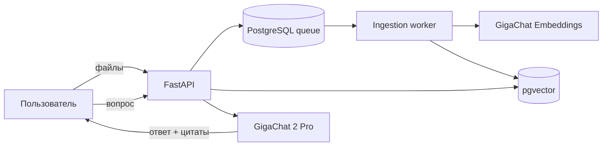

# Контекст — RAG по корпоративным документам

Веб-приложение объединяет связанные документы в пространства знаний, индексирует их и отвечает на вопросы со ссылками на конкретные файлы и фрагменты. Поддерживаются PDF, DOCX, XLSX, PPTX, TXT, Markdown, CSV и HTML; генерация и эмбеддинги выполняются через GigaChat API.

## Возможности

- множественная загрузка и drag-and-drop;
- долговечная фоновая очередь обработки в PostgreSQL;
- гибридный поиск: pgvector + русскоязычный full-text search;
- диалоги с нумерованными источниками и историей;
- дедупликация по SHA-256 внутри пространства;
- полностью офлайн-режим `RAG_LLM_PROVIDER=fake docker compose up -d` для проверки UI;



## Быстрый старт

1. Скопируйте `.env.example` в `.env` и укажите `GIGACHAT_API_KEY`. Если `.env` уже заполнен, оставьте его без изменений.
2. Запустите проект:

   ```bash
   docker compose up --build -d
   docker compose run --rm api python -m rag_app.seed
   ```

3. Откройте [http://localhost:8000](http://localhost:8000), выберите «Демо: Acme» и дождитесь статуса «Готов».
4. Спросите: «Какой лимит гостиницы в Москве?» или загрузите собственные файлы.

Для просмотра логов используйте `make logs`, для остановки — `make stop`. Swagger UI доступен на [http://localhost:8000/api/docs](http://localhost:8000/api/docs).

## Проверка

```bash
make test     # pytest и покрытие, внешние модели не вызываются
make lint     # Ruff и mypy
```

Live-проверки GigaChat должны запускаться отдельно и осознанно: они расходуют токены. Основной CI использует детерминированный fake-провайдер.

## Структура

```text
src/rag_app/        API, worker, retrieval, providers, web UI
tests/              unit и integration-тесты
examples/acme-corp/ связанные демонстрационные документы
docs/               русская проектная документация и схемы
```

Начните с [обзора документации](docs/README.md), затем прочитайте [архитектуру](docs/ARCHITECTURE.md), [аудит RAG](docs/AUDIT.md) и [руководство пользователя](docs/USER_GUIDE.md).

> Текущий релиз предназначен для локального или защищённого внутреннего контура. До публикации в общей сети необходимо добавить корпоративную аутентификацию и разграничение доступа по пространствам.
