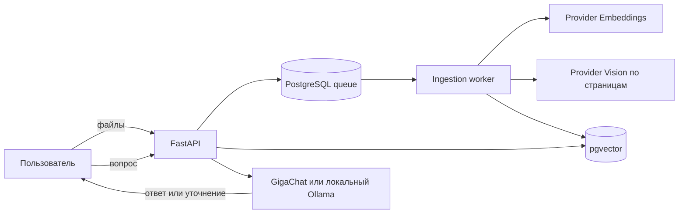

# Контекст — RAG по корпоративным документам

Веб-приложение объединяет связанные документы в пространства знаний, индексирует их и отвечает на вопросы со ссылками на конкретные файлы и фрагменты. Поддерживаются PDF, DOCX, XLSX, PPTX, TXT, Markdown, CSV и HTML; генерация, embeddings и vision работают через GigaChat API либо полностью локальный Ollama.

## Возможности

- множественная загрузка и drag-and-drop;
- долговечная фоновая очередь обработки в PostgreSQL;
- гибридный поиск: pgvector + русскоязычный full-text search;
- диалоги с нумерованными источниками и историей;
- анализ пошаговых PDF/DOCX-инструкций со скриншотами, стрелками и выделениями;
- сохранение точных внешних ссылок из DOCX и безопасный кликабельный вывод `http`/`https` URL;
- самодостаточные инструкции для новичка: подготовка, атомарные шаги, проверка результата и помощь;
- встроенный визуальный туториал: страницы одного найденного файла показываются сразу, а при
  нескольких руководствах пользователь выбирает нужное без нового LLM-запроса;
- структурированные уточнения с кнопками, когда правило зависит от подразделения, категории или вида расхода;
- дедупликация по SHA-256 внутри пространства;
- полностью офлайн-режим `RAG_LLM_PROVIDER=fake docker compose up -d` для проверки UI;
- локальный Ollama-контур без API-ключей для macOS и Windows;



## Быстрый старт

1. Скопируйте `.env.example` в `.env` и укажите `GIGACHAT_API_KEY`. Если `.env` уже заполнен, оставьте его без изменений.
2. Запустите проект:

   ```bash
   docker compose up --build -d
   make demo
   ```

3. Откройте [http://localhost:8000](http://localhost:8000), выберите «Демо: Acme» и дождитесь статуса «Готов».
4. Спросите: «Какой испытательный срок указан в договоре?», «Какой у меня формат работы?» или
   «Кто согласует мне доступ?». В неоднозначном вопросе выберите подразделение, роль или систему.

`make demo` загружает 50 связанных документов Acme во всех восьми поддерживаемых форматах и
безопасно пропускает уже добавленные файлы при повторном запуске.

PDF/DOCX с изображениями worker сначала рендерит постранично через Poppler/LibreOffice, затем
передаёт каждую страницу в GigaChat и индексирует найденные действия в исходном порядке. Такая
индексация занимает больше времени, чем обработка обычного текста. Настройки начинаются с
`VISION_` и `VISUAL_` в `.env.example`; `VISION_INGESTION_ENABLED=false` включает текстовый fallback.
Для DOCX worker отдельно читает relationship-цели гиперссылок: ответ может показать точный адрес
загрузки, а не только подпись ссылки или номер источника. Визуальные шаги дополняются исходным
текстом Word, чтобы не потерять финальную проверку и контакты поддержки.
Процитированные страницы одного визуального файла автоматически появляются под текстовым ответом
в исходном порядке. Если ответ действительно опирается на несколько файлов с иллюстрациями, чат
сначала предлагает выбрать конкретный туториал, чтобы не смешивать разные последовательности.

Для передачи заказчику без внешнего API используйте готовый
[гайд по локальным моделям](docs/LOCAL_MODELS.md) и `.env.ollama.example`. Он покрывает установку
Ollama/Docker Desktop, модели для 32 ГБ RAM, запуск на macOS/Windows и самопроверку.

Для просмотра логов используйте `make logs`, для остановки — `make stop`. Swagger UI доступен на [http://localhost:8000/api/docs](http://localhost:8000/api/docs).

## Проверка

```bash
make test     # pytest и покрытие, внешние модели не вызываются
make lint     # Ruff и mypy
```

Live-проверки GigaChat должны запускаться отдельно и осознанно: они расходуют токены. Основной CI использует детерминированный fake-провайдер.

## Структура

```text
src/rag_app/        API, worker, retrieval, providers, web UI
tests/              unit и integration-тесты
examples/acme-corp/ связанные демонстрационные документы
docs/               русская проектная документация и схемы
```

Начните с [обзора документации](docs/README.md), затем прочитайте [архитектуру](docs/ARCHITECTURE.md), [аудит RAG](docs/AUDIT.md) и [руководство пользователя](docs/USER_GUIDE.md).

> Текущий релиз предназначен для локального или защищённого внутреннего контура. До публикации в общей сети необходимо добавить корпоративную аутентификацию и разграничение доступа по пространствам.
