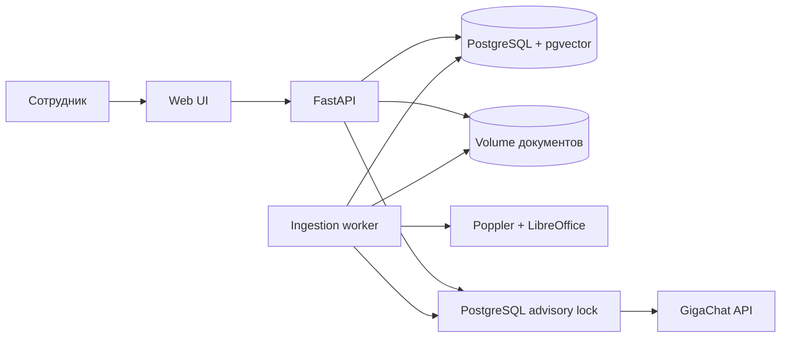
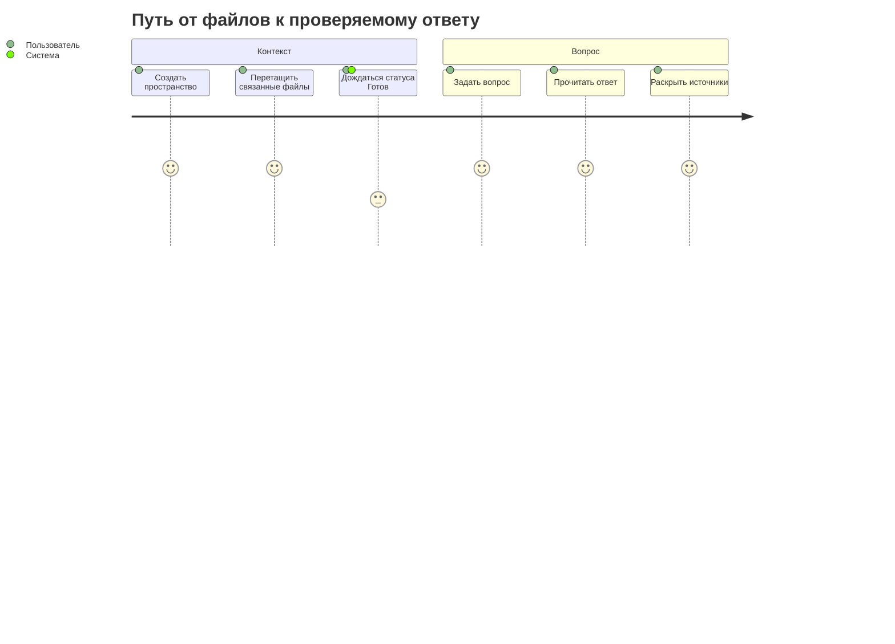
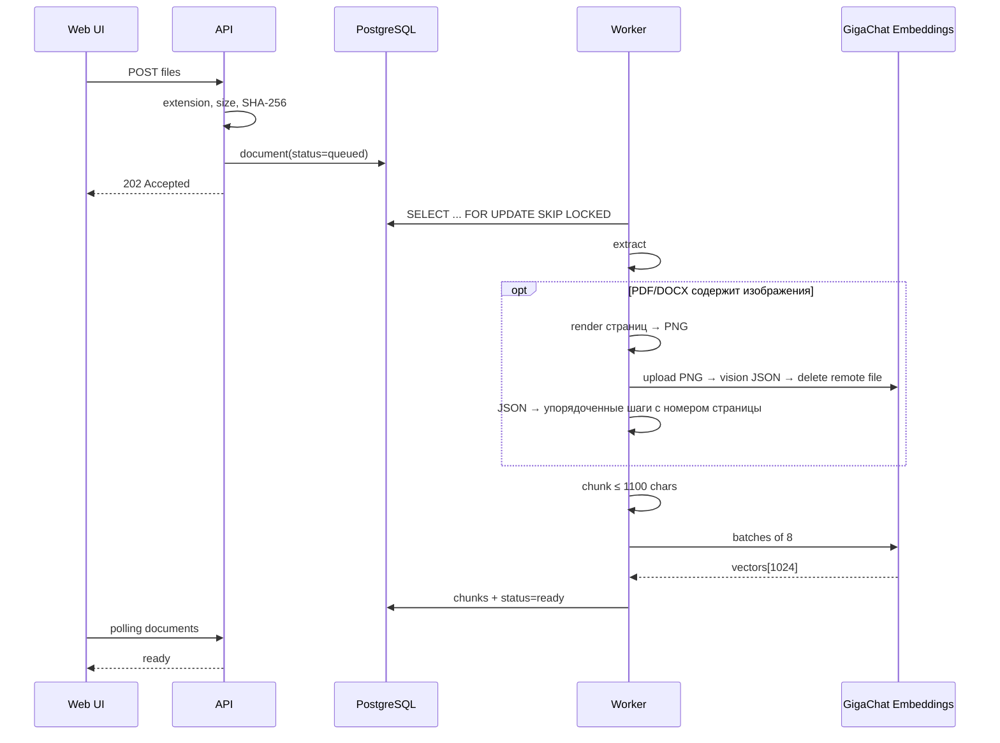
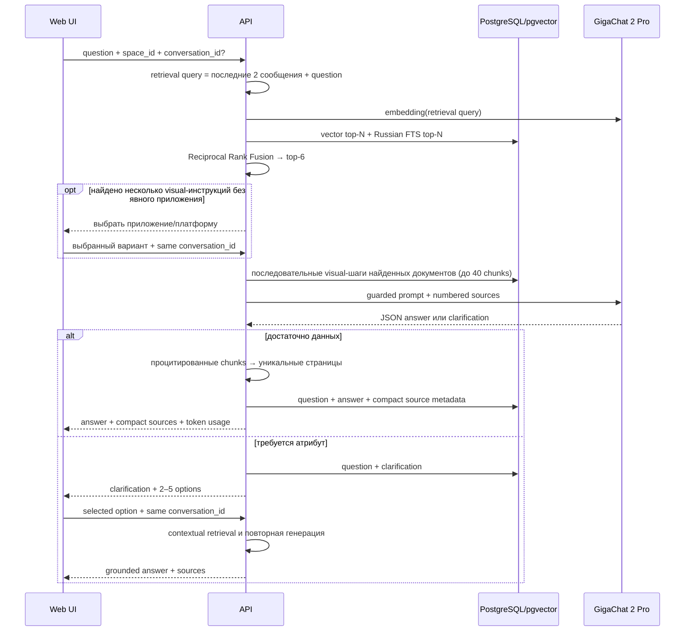

# Архитектура

## Контекст

Один локальный web-клиент обращается к FastAPI. API хранит метаданные и диалоги в PostgreSQL, а
файлы и изображения страниц — в Docker volume. Worker извлекает обычный текст; PDF/DOCX со
встроенными изображениями дополнительно рендерит постранично, разбирает через GigaChat Vision и
вызывает GigaChat Embeddings. На вопрос API выполняет hybrid retrieval, уточняет визуальный сценарий
при нескольких подходящих инструкциях, разворачивает выбранную последовательность шагов и вызывает
GigaChat 2 Pro. Источники ответа строятся отдельно: только из процитированных уникальных страниц.

## Инварианты

- Поиск никогда не пересекает границу `space_id`.
- Ответ получает только извлечённые фрагменты; контекст считается недоверенным.
- Каждый пользовательский факт должен иметь цитату `[N]`; при нехватке данных модель сообщает об этом.
- Если выбор правила зависит от отсутствующего атрибута, модель задаёт один вопрос с 2–5 вариантами, а не предполагает ответ.
- `.env`, ключи и access token не сохраняются в БД и не возвращаются API.
- Индекс создаётся одной моделью `Embeddings-2` размерности 1024.
- Вызовы GigaChat сериализуются между процессами для лимита одного потока.

## Компоненты и границы

| Компонент | Ответственность | Отказ |
| --- | --- | --- |
| Web UI | пространства, upload, polling, чат, источники | показывает безопасное сообщение API |
| API | валидация, метаданные, retrieval, generation | 4xx для входа, 502 для провайдера |
| Worker | claim, extract, render, vision, chunk, embed, status | документ получает `error`, доступен retry |
| PostgreSQL | очередь, версии, HNSW, FTS, диалоги | health становится degraded |
| GigaChat adapter | OAuth, embeddings, chat, image upload/analyze/delete | секреты редактируются, ошибка не маскируется |

## Путь пользователя

## Системный flow индексации

## Системный flow ответа

## Latency и capacity

Upload отвечает после записи файла, не после embeddings. Индексация выполняется одним worker и ограничена внешним API. Chat включает query embedding, два SQL-поиска и generation; целевой бюджет для локального контура — до 30 секунд без формального SLO. HNSW рассчитан на 1024-мерные векторы; масштабная смена модели требует миграции.

## Значимые решения

- [ADR-001: Embeddings-2 и vector(1024)](decisions/ADR-001-embedding-and-vector-schema.md).
- Внешний LangChain не используется: явные адаптеры уменьшают скрытую связанность и упрощают eval.
