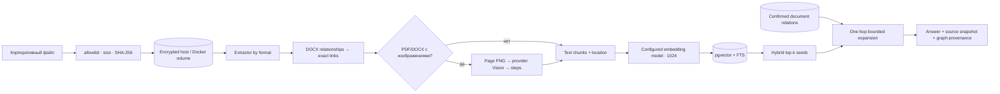

# Данные

## Сущности и владельцы

| Сущность | Назначение | Владелец | Идентификатор |
| --- | --- | --- | --- |
| Knowledge space | граница связанного контекста | владелец знаний | UUID |
| Document | версия загруженного файла и статус | загрузивший пользователь | UUID + SHA-256 |
| Document relation | направленная типизированная связь и evidence | владелец знаний | UUID |
| Chunk | текстовый фрагмент или visual-шаг, location и vector(1024) | система ingestion | UUID + chunk index |
| Conversation | история вопросов в одном space | пользователь | UUID |
| Message | текст ответа и снимок источников | пользователь/система | UUID |

## Lifecycle и версии

Файл проверяется, получает SHA-256 и сохраняется в volume. Одинаковый hash нельзя повторно загрузить
в одно пространство, но можно — в другое. Worker переводит `queued → processing → ready|error`;
зависший `processing` повторно доступен через 15 минут. Связать можно только два `ready`-документа
одного пространства. Пользовательская связь сразу получает `confirmed`; `suggested` зарезервирован
для будущих предложений и не участвует в retrieval. Удаление документа каскадно удаляет chunks,
relations и файл. История диалогов хранится до удаления пространства или БД.

## Provenance и чувствительность

Для ответа сохраняются `document_id`, filename, location, excerpt, fusion-score и URL страницы при
наличии. Рядом с исходным файлом worker хранит `pages/page-N.png`; каталог удаляется вместе с
документом. Это позволяет проверить происхождение, даже если retrieval позднее изменится.
Корпоративные файлы, изображения страниц и сообщения считаются конфиденциальными; volume и
PostgreSQL нельзя публиковать или копировать без политики владельца. В режиме GigaChat PNG
пересекает внешнюю границу только на время анализа и затем удаляется через API. В режиме Ollama
текст и PNG остаются на хосте заказчика; загрузка весов модели не содержит документы.

Для DOCX внешний hyperlink сохраняется отдельным chunk с location `внешние ссылки` в виде
`подпись: точный target`. Разрешены схемы `http`, `https` и `mailto`, targets валидируются,
дедуплицируются и ограничиваются первыми 50 ссылками. JavaScript, file и другие схемы отбрасываются.
Visual retrieval сохраняет этот chunk и исходный `текст` Word рядом с описаниями страниц: URL,
последние шаги, критерий успеха и контакты не теряются при постраничной обработке.

## Демо-корпус

`examples/acme-corp/` содержит 50 взаимосвязанных файлов во всех поддерживаемых форматах:

| Тема | Основные документы | Вариативность |
| --- | --- | --- |
| Удалённая работа | базовая HTML-политика + 3 соглашения | продажи, инженеры, регионы |
| Квартальный бонус | базовое MD-положение + 2 соглашения | продажи, продукт |
| Командировки | базовые TXT/CSV + 2 соглашения | руководители, северные регионы |
| Закупки | CSV-пороги + PPTX-процесс | OpEx и CapEx |
| Операции и ИБ | структура, классификация, playbook, XLSX-реестры | роли, статусы, сроки |
| Трудовые условия | договор DOCX, условия MD, HTML-политика, XLSX-графики | офис, гибрид, смены |
| Обязательные политики | ресурсы, персональные данные, видеонаблюдение, офис, охрана труда | зоны, сроки, роли |
| Адаптация и культура | PDF-код, XLSX 30–60–90, чек-листы и тренинги | отдел и роль новичка |
| Подразделения и продукт | 5 расшифровок, обзор и сценарии Context | зоны ответственности |
| IT и рабочее место | архитектура, каталог систем, DOCX/HTML/TXT-инструкции | система и маршрут доступа |

Десять дополнительных соглашений явно задают дату вступления, область действия и приоритет.
`examples/demo_cases.json` хранит 36 inspectable-кейсов типов `answer`, `clarification` и
`two_turn` — по 12 каждого типа. Каждый кейс содержит `source_files`; сам JSON не индексируется.

## Data flow

## Восстановление

Метаданные восстанавливаются из backup PostgreSQL, файлы — из backup volume. Векторы производны:
при их потере документы можно переиндексировать из raw-файлов. Смена GigaChat/Ollama или конкретной
embedding-модели требует полного reindex, потому что сравнивать векторы разных моделей нельзя даже
при одинаковой размерности 1024.
