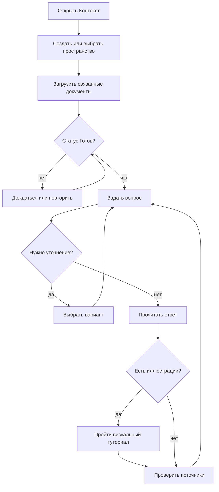

# Руководство пользователя

## Первый запуск

1. Откройте `http://localhost:8000`.
2. Нажмите `+` рядом с «Пространства» и назовите общий контекст, например «Кадровые политики».
3. Перетащите связанные файлы в область загрузки. Поддерживаются PDF, DOCX, XLSX, PPTX, TXT, MD, CSV и HTML до 25 МБ каждый.
4. Дождитесь зелёного статуса «Готов». При ошибке наведите курсор для текста и нажмите `↻`.
5. Задайте конкретный вопрос. Под ответом откройте карточки `[1]`, `[2]` и сверьте факты с документами.

PDF/DOCX со скриншотами обрабатываются постранично и поэтому могут индексироваться заметно дольше
текстовых файлов. Не удаляйте документ и не останавливайте worker до статуса «Готов».

## Как получать лучшие ответы

- Загружайте документы одной темы в одно пространство; не смешивайте HR и несвязанные технические руководства.
- Формулируйте объект и период: «Какой лимит такси в командировке?» лучше, чем «Какой лимит?».
- Проверяйте источник, особенно для решений с финансовыми или юридическими последствиями.
- Общий запрос по нескольким визуальным инструкциям сначала предложит выбрать приложение или
  платформу, например Outlook либо стандартную «Почту» iOS.
- Если все найденные иллюстрации относятся к одному файлу, под текстом сразу появится «Визуальный
  туториал». Смотрите изображения сверху вниз; нажмите `Открыть крупно`, если детали мелкие.
- Если иллюстрации относятся к нескольким файлам, выберите нужный файл кнопкой. Чат покажет только
  его последовательность и не отправит дополнительный запрос модели.
- Ниже остаются компактные источники. Нажмите `Показать ещё` и раскройте нужную карточку, чтобы
  проверить текст фрагмента, связь документов и исходную страницу.
- После замены политики удалите старую версию, иначе система честно найдёт обе и может указать противоречие.

## Как пользоваться пошаговой инструкцией

Для запроса вроде «Настройка VPN VMware VPN Client» ответ должен быть самодостаточным:

1. В «Перед началом» проверьте, что нужно скачать или подготовить.
2. В «Сделайте по шагам» нажмите выделенный URL и выполняйте действия сверху вниз. Номер `[N]`
   подтверждает источник, но не заменяет сам адрес загрузки.
3. В «Как проверить» сравните результат на экране с указанным признаком успеха.
4. Если результат другой, выполните «Если не получилось» и используйте только контакт из документа.

Ссылка из Word показывается кликабельно и открывается в новой вкладке. Визуальный туториал под
ответом повторяет только процитированные страницы найденного файла и не заменяет текстовые шаги.
Для проверки точной формулировки раскройте источник. Если адреса в исходном файле нет, система
должна прямо сообщить об этом, а не придумывать URL.

## Если система задаёт уточняющий вопрос

Когда найденные документы содержат разные правила для подразделений, категорий сотрудников,
регионов или видов расхода, чат не выбирает вариант за вас. Под вопросом появляются 2–5 кнопок.
Нажмите подходящую — выбор отправится в тот же диалог, а исходный вопрос будет учтён при новом
поиске. Можно также написать уточнение своими словами, например «Я из отдела продаж».

Если ни один вариант не подходит, добавьте недостающий атрибут текстом. Для финансово или
юридически значимого решения всё равно раскройте источники итогового ответа.

## Как связать документы

1. Дождитесь статуса «Готов» у обоих документов и нажмите `Связи` рядом со счётчиком документов.
2. Выберите исходный документ, тип отношения и связанный документ. Направление читается слева
   направо: «Дополнительное соглашение — изменяет → Трудовой договор».
3. Укажите проверяемое основание, например «заменяет пункт 4 с 01.09.2026», и нажмите
   `Добавить связь`.
4. Проверьте созданную строку в списке. Кнопка `×` удаляет ошибочную связь.

Сходство названий не создаёт связь автоматически. Поиск использует только подтверждённые связи,
делает один переход и добавляет ограниченное число релевантных фрагментов. Если ответ использовал
такой фрагмент, источник содержит пометку «Добавлен по подтверждённой связи» и её основание.

## Статусы

`В очереди` — файл принят; `Индексируется` — извлекается текст и создаются embeddings; `Готов` — участвует в ответах; `Ошибка` — формат повреждён, текст отсутствует или внешний API недоступен.
