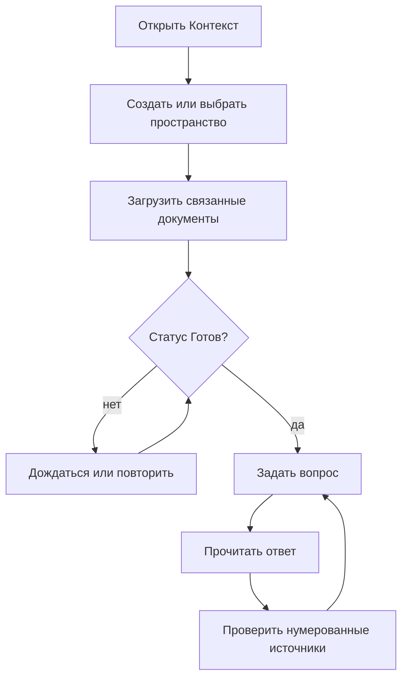

# Руководство пользователя

## Первый запуск

1. Откройте `http://localhost:8000`.
2. Нажмите `+` рядом с «Пространства» и назовите общий контекст, например «Кадровые политики».
3. Перетащите связанные файлы в область загрузки. Поддерживаются PDF, DOCX, XLSX, PPTX, TXT, MD, CSV и HTML до 25 МБ каждый.
4. Дождитесь зелёного статуса «Готов». При ошибке наведите курсор для текста и нажмите `↻`.
5. Задайте конкретный вопрос. Под ответом откройте карточки `[1]`, `[2]` и сверьте факты с документами.

## Как получать лучшие ответы

- Загружайте документы одной темы в одно пространство; не смешивайте HR и несвязанные технические руководства.
- Формулируйте объект и период: «Какой лимит такси в командировке?» лучше, чем «Какой лимит?».
- Проверяйте источник, особенно для решений с финансовыми или юридическими последствиями.
- После замены политики удалите старую версию, иначе система честно найдёт обе и может указать противоречие.

## Статусы

`В очереди` — файл принят; `Индексируется` — извлекается текст и создаются embeddings; `Готов` — участвует в ответах; `Ошибка` — формат повреждён, текст отсутствует или внешний API недоступен.
